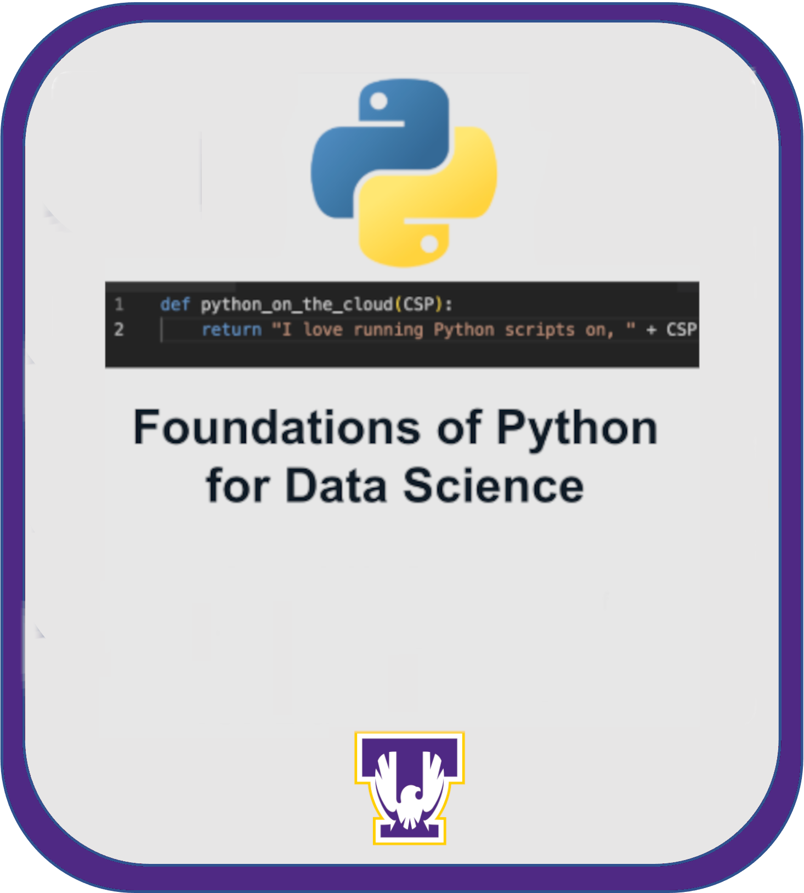

# Introduction to Python for Bioinformatics
---------------------------------------------------

    

## **Contents**

- [Practical Data-Centric Python for Biomedical Researchers](#practical-data-centric-aiml-for-biomedical-researchers)
	- [**Contents**](#contents)
	- [**Overview**](#overview)
	- [**Background**](#background)
	- [**Before Starting**](#before-starting)
	- [**Getting Started**](#getting-started)
	- [**Software Requirements**](#software-requirements)
	- [**Architecture Design**](#architecture-design)
	- [**Data**](#data)
	- [**Module Outline**](#module-outline)
	- [**Funding**](#funding)
	- [**License for Data**](#license-for-data)

## **Overview**
The module prioritizes practical coding techniques for biological scientists who have limited or no background in programming in Python or other languages. The module also utilizes a blend of short instructional videos, interactive demonstrations, and hands-on exercises to facilitate self-directed learning and knowledge retention.

Module 0 provides the background information you need to create a Cloud Computing account at Azure, to copy the needed tutorials from Github (where they are stored), and how to use Github for your data storage needs.

Module 1 is a set of foundational tutorials in Python

Module 2 expands the Python toolbox to NumPy & Pandas (great data handling tools), graphing libraries and statistics for bioinformatics. 

Module 3 tutorials show how to save and edit Python scripts to extend your programming outside of Jupyter notebooks for reproducibly running programming tasks.

## **Background**

Bioinformatics enables the extraction of meaningful insights from biological data, contributes to advancements in medicine and biotechnology, and plays a crucial role in understanding the complexities of living organisms. As biological research continues to generate large datasets, skills in bioinformatics are increasingly valuable for students, researchers, and professionals in the life sciences. Biological data science jobs in industry always require experience with using and creating NGS pipelines, proficiency in Python and/or R, and familiarity with git version control. The centrality of these computer-aided approaches in the lab and industry demands the increased incorporation of these skills in undergraduate curricula through advanced research projects. 

The enormous data sets used in and created by bioinformatics studies, including metadata, are expected to be made available to the public according to FAIR principles (Wilkinson et al, 2016). Starting in 2023, all NSF and NIH grantees are expected to develop and maintain a public data and tool repository in the cloud. While the deposition of DNA sequences to the NCBI GenBank is familiar to many biology researchers, data sharing of other types faces technical and motivational barriers for researchers. Using general repositories, and how both data and bioinformatics pipelines can be managed by git, is quite unfamiliar to most biologists. We believe that offering GitHub as a viable solution to the problem of identifying and using a data repository would be a strong incentive for researchers, especially those who are computer science novices, to utilize our proposed training module.

With the generous support of the NIH NIGMS Cloud Computing project, we have created a module to teach foundational Git tools and Introductory Python Programming for Bioinformatics. It is intended that this will give you a foundation for using more detailed and advanced Modules in the NIGMS sandbox which rely on Python. Furthermore, you will have the tools you need for storing, conveniently, your data on GitHub according to FAIR principles.

## **Before Starting**  
* This Module has been tested on Azure but the method for working with the Notebooks and data on Amazon Web Services (AWS) or Google Cloud Platform (GCP) is similar. You should determine in which cloud platform you will work. 

This *Introduction to Python* course, even if you work very slowly, should cost less than $5 of cloud computing time. You will also have compute storage charges, so you should download and delete these tutorials from the cloud when you have finished using them.

## **Getting Started**

You can view the information in Module 0 in your browser by clicking on the Github folder (above) for Submodule 0. It provides instructions on how to set up a cloud account to use this, and other, tutorials. 

Additional information on how to [create an Azure account](https://github.com/NIGMS/NIGMS-Sandbox/blob/main/docs/HowToCreateAzureMLNotebooks.md) is provided by the NIGMS in abbreviated form for those with a subscription to Azure.

* Video directions can be viewed at [Learning Modules for Cloud-Based Biomedial Research.](https://www.youtube.com/playlist?list=PLXaEJPtnQ4w7Vu7vqWbttBjUGrPp4Qa7b)

## **Software Requirements**
* If you use the cloud, **you do not need any additional software**.
* These notebooks *can* be used in a desktop setting with a free download of Anaconda (anaconda.com) using their Jupyter Notebooks module. 
* Individual notebooks can be run with limited functionality in a web browser (e.g., colab.research.google.com)
* It is also possible to use GitHub's VSCode functions.
* Module 0 provides instructions to download and use Github Desktop.

## **Architecture Design**
This course is arranged into 4 sub-modules (0 through 3).

- Submodule 0 is intended as a non-technical introduction so that you can do more technical things (e.g., create a cloud account and copy the tutorials)
- Submodule 1 is the very basic Python introduction for those who are new to programming in general or just new to how the Python language works.
- Submodule 2 builds on the foundations of Python in Submodule 1 to introduce powerful tools for large data sets.
- Submodule 3 introduces key object-oriented programming tools. Its tutorials also build on Submodule 1 to give you the skills to build your own python tools.

Within each submodule, there are several tutorials (basically, topics) with embedded quizzes. They are numbered to make it easy to know the flow of the topics. Each tutorial ends with a link to the next tutorial, or a link to the guided, summative project.

Each module includes at least one guided 'project' that allows you to practice your skills with a coding exercise you might later need to do with your own data or problem.

## **Data**
Data will be obtained from online databases (e.g., NCBI) or will be in folders in the submodule. You will learn to use the Python tools that can read large data sets without needing to download them to your computer hard drive.

## **Module Outline**
**Module 0 - Intro to Cloud Computing and Git**
- Lecture (upcoming)

- Tutorial 1: Github Download   *how to get the tutorials*
- Tutorial 2: Jupyter Notebooks  *how to navigate these tutorials*
- Tutorial 3: AzureML  *how to start using a cloud computer*
- Tutorial 3b: AzureML *CloudLab details*
- Tutorial 4: GitHub 4 You *how Git and Github can be useful for you as a bioinformatician*
- Tutorial 5: Managing Git *how to manage your Github repositories for multiple users*  
- Tutorial 6: Digital Object Identifiers for GitHub *Creating citable identifiers for your data at Zenodo*
  
**Submodule 1 - Foundations of Python**

Learn core concepts, diverse applications, introductory algorithms, ethical considerations, and data challenges.

-
  - 
- Tutorials
  - Tutorial 1: Python Overview
  - Tutorial 2: Variables
  - Tutorial 3: Data Structures
  - Tutorial 4: Functions
- Project
  - Tutorial 5: Using NCBI sequences
  - Tutorial 5 Project Answer (SOLUTIONS for Using NCBI sequences)

**Submodule 2 - Intro to Data Science with Python**

Learn Data Science with NumPy and Pandas

- Lecture
  - 
- Tutorials
  - Tutorial 0: Overview
  - Tutorial 1: NumPy
  - Tutorial 2: Pandas
     - Tutorial 2a: Pandas PDB Exercise
     - Tutorial 2b: Pandas RNA-seq Guided Excercise
  - Tutorial 3:Visualizing Data
  - Tutorial 4: Inferential Statistics
- Project
  - Tutorial 6a Using data
  - Tutorial 6bProject with solutions

**Submodule 3 - **

- Tutorial 0: Overview of OOP
- Tutorial 1: Introduction to Python OOP
- Tutorial 2: OOP2
- Project: Patient data import with the Patient Class

